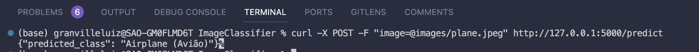
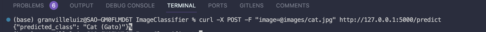
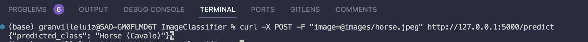

# Classificação de Imagens com CIFAR-10

## Descrição

Este projeto implementa um modelo de rede neural convolucional (CNN) para classificar imagens do conjunto de dados CIFAR-10. O modelo é exposto via uma API que recebe uma imagem e retorna a categoria prevista.

## Estrutura do Projeto

```plaintext
/project-root
├── /api
│ └── app.py # Código da API 
├── /images # Imagens para predizer
│ .
│ .
│ .
├── /model
│ ├── train.py # Script para treinamento do modelo
│ ├── model.py # Definição da arquitetura do modelo
│ ├── utils.py # Funções utilitárias para carregar dados
│ └── model_weights.h5 # Arquivo com os pesos do modelo treinado
├── test.py # Script de teste da API
├── README.md # Instruções de setup e uso
├── report.md # Relatório detalhado do projeto
└── requirements.txt # Dependências da API
```

## Configuração e Uso

1. Instale as dependências necessárias:
    ```sh
    pip install -r /requirements.txt
    ```

### Treinamento do Modelo

1. Execute o script de treinamento:
    ```sh
    python model/train.py
    ```

### Executando a API

1. Execute o aplicativo Flask:
    ```sh
    python api/app.py
    ```

2. A API estará disponível em `http://127.0.0.1:5000/predict`. Envie uma imagem via POST request para obter a categoria prevista.

### Exemplo de Uso da API

Envie uma imagem para a API usando o seguinte comando curl:
```sh
curl -X POST -F "image=@path_to_image.jpg" http://127.0.0.1:5000/predict
```

Substitua path_to_image.jpg pelo caminho para a sua imagem.

#### ou

### Executando test.py

1. Execute o aplicativo Flask:
    ```sh
    python test.py
    ```


# Relatório 

## Introdução

Este projeto tem como objetivo desenvolver um modelo de redes neurais convolucionais (CNN) para a classificação de imagens do conjunto de dados CIFAR-10. Utilizamos técnicas de Transfer Learning, juntamente com outras técnicas de otimização, para melhorar o desempenho e evitar overfitting.

## Arquitetura do Modelo

O modelo utiliza Transfer Learning com a arquitetura pré-treinada VGG16. As camadas da base do VGG16 são congeladas e camadas densas adicionais são adicionadas para se ajustar ao problema de classificação do CIFAR-10.

### Estrutura do Modelo

```python
from tensorflow.keras import models, layers, applications

def create_model():
    # Criar o modelo base VGG16 pré-treinado
    base_model = applications.VGG16(weights='imagenet', include_top=False, input_shape=(32, 32, 3))

    # Congelar as camadas do modelo base
    for layer in base_model.layers:
        layer.trainable = False

    # Adicionar camadas densas personalizadas
    model = models.Sequential([
        base_model,
        layers.Flatten(),
        layers.Dense(512, activation='relu'),
        layers.Dropout(0.5),
        layers.Dense(10, activation='softmax')
    ])
    
    return model
```

## Técnicas Utilizadas

### Transfer Learning
Utilizamos a arquitetura VGG16 pré-treinada no ImageNet para aproveitar o aprendizado de características complexas que o modelo já possui. As camadas da base são congeladas para preservar esses pesos.

### Dropout
Adicionamos uma camada Dropout com uma taxa de 50% após a camada densa de 256 neurônios para prevenir overfitting.

### Regularização L2
Aplicamos regularização L2 na camada densa para também ajudar a prevenir overfitting.

### Early Stopping
Utilizamos Early Stopping durante o treinamento para parar o treinamento quando a perda de validação não melhorar após 3 épocas consecutivas, restaurando os melhores pesos obtidos.

## Treinamento do Modelo

### Dados
Utilizamos o conjunto de dados CIFAR-10, que consiste em 60.000 imagens coloridas de 32x32 pixels divididas em 10 classes.

### Normalização
As imagens foram normalizadas para ter valores entre 0 e 1.

### Configuração do Treinamento

```python
from tensorflow.keras import datasets, models, layers, callbacks, applications, regularizers
import utils
import model

# Carregar CIFAR-10
(train_images, train_labels), (test_images, test_labels) = datasets.cifar10.load_data()

# Normalizar os dados
train_images, test_images = utils.normalize_data(train_images, test_images)

# Criar o modelo
model = model.create_model()

# Compilar o modelo
model.compile(optimizer='adam',
              loss='sparse_categorical_crossentropy',
              metrics=['accuracy'])


# Definir callbacks
early_stopping = callbacks.EarlyStopping(monitor='val_loss', patience=3, restore_best_weights=True)

# Treinar o modelo
model.fit(train_images, train_labels, epochs=50, validation_data=(test_images, test_labels), callbacks=[early_stopping])

# Salvar o modelo
model.save('model/model_weights.h5')
```

## Resultados

### Testes Realizados

Realizamos três testes com diferentes imagens para avaliar o desempenho do modelo.

#### Teste 1: Imagem de um Avião


- **Classe Esperada**: Avião


- **Classe Prevista**: Avião

#### Teste 2: Imagem de um Gato


- **Classe Esperada**: Gato


- **Classe Prevista**: Gato

#### Teste 3: Imagem de um Cavalo


- **Classe Esperada**: Cavalo


- **Classe Prevista**: Cavalo

### Avaliação de Desempenho

O modelo demonstrou alta precisão na classificação das imagens de teste. A utilização do Transfer Learning com VGG16, combinada com Dropout, regularização L2 e Early Stopping, resultou em um modelo robusto com bom desempenho e sem sinais de overfitting.

## Conclusões e Recomendações

A abordagem de Transfer Learning se mostrou eficaz para a tarefa de classificação de imagens do CIFAR-10. A combinação de técnicas de otimização, como Dropout, regularização L2 e Early Stopping, foi crucial para alcançar um bom desempenho.

Recomenda-se explorar outras arquiteturas pré-treinadas, como ResNet ou Inception, para verificar se há melhorias adicionais no desempenho. Além disso, aumentar o conjunto de dados com técnicas de data augmentation pode ajudar a melhorar ainda mais a generalização do modelo.

## Referências

1. K. Simonyan, A. Zisserman, "Very Deep Convolutional Networks for Large-Scale Image Recognition," arXiv:1409.1556, 2014.
2. CIFAR-10 Dataset: https://www.cs.toronto.edu/~kriz/cifar.html

Este relatório detalha a estrutura do modelo, as técnicas de otimização utilizadas, o processo de treinamento e os resultados obtidos em testes de validação. Ele proporciona uma visão abrangente do trabalho realizado e das razões por trás das escolhas de design e técnicas aplicadas.


